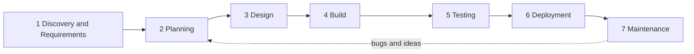

# 1. The Lifecycle, Without AI

Every piece of software, big or small, goes through the same stages. Before you let AI do any of it, you need to know what the work actually is. This guide has no AI in it on purpose.

Learn each stage with the `teach-me` skill, for example: "teach me the requirements stage of the SDLC". Log each one in `LEARNING_LOG.md`.

---

## Stage 1: Discovery and Requirements

**What it is:** finding out what the software must do, for whom, and how you will know it works. Most failed projects fail here, not in the code.

- **Gather context.** Talk to the people who will use it. Take notes or record the call. Collect everything else that helps: emails, messages, screenshots, the spreadsheets they use today.
- **Study how it works today.** Look at the current process and data. What is kept where, by whom, and what goes wrong with it.
- **State the problem.** One or two sentences: what is painful today, and for whom.
- **Name the users.** Who uses it, and what each type of user needs to do.
- **List the must-haves.** What it has to do (functional requirements).
- **List the qualities.** How well it has to do it: fast enough, works on a phone, keeps data private (non-functional requirements).
- **Fill the gaps.** Write down what you still do not know, and ask.
- **Write acceptance criteria.** For each must-have, a clear test of "done". A common form: *Given* a situation, *when* the user does something, *then* this happens.
- **Say what is out of scope.** What you are deliberately not building.

## Stage 2: Planning

**What it is:** turning the requirements into an order of work you can actually finish.

- **Write user stories.** "As a [user], I want [thing] so that [reason]."
- **Break stories into tasks.** Each task small enough to finish in an hour or two.
- **Order the tasks.** What depends on what, and what matters most.
- **Pick the first visible slice.** The smallest thing you can show someone early, so they can react to it.
- **Guess the time.** A rough estimate per task. You will be wrong; that is fine, you learn from the difference.

## Stage 3: Design

**What it is:** deciding how it will be built before you build it.

- **Architecture.** The main parts and how they talk to each other, for example: browser, application, data store.
- **Data model.** What you store: the tables or records, their fields, and how they link.
- **Folder structure.** Where code, tests and documents live. There is more than one good answer; pick one and know why.
- **User interface.** The screens and the path a user takes through them.
- **Early feedback.** Show the design to a real person before you build it. Changing a picture is cheap; changing code is not.

## Stage 4: Build

**What it is:** writing the software, one small piece at a time.

- **Set up the project.** Create the application, install what it needs, and get "hello world" running.
- **Build one task at a time,** in the order from your plan.
- **Run it after every change.** Never stack up untested changes.
- **Review every change.** Read it and understand it before you keep it. Check the logic, look for obvious security holes, and make sure it is readable.
- **Commit often,** with a message that says what changed and why.

## Stage 5: Testing

**What it is:** proving the software does what the requirements say, and finding what breaks before a user does. Test as the user, not as the person who wrote the code.

- **Test plan.** What you will test, which type of test covers it, and what "pass" means. Start from your acceptance criteria.
- **Unit tests.** Test one small piece of logic on its own, for example: the function that works out a total.
- **Integration tests.** Test parts working together, for example: saving a record and reading it back from the data store, or calling your own API.
- **UI tests (end to end).** A tool such as Playwright opens a real browser and clicks through your app like a user would, then checks what appears on screen.
- **Edge cases and negative tests.** Wrong input, empty fields, very long text, a failing network, a user doing things in the wrong order.
- **Regression testing.** Re-running your tests after every change to prove that what worked before still works. Your whole test suite, run before each release, is your regression pack.
- **UAT (user acceptance testing).** Using the finished app as the user would, going through each acceptance criterion and marking it pass or fail.

## Stage 6: Deployment

**What it is:** getting the software from your machine to where people can use it, safely and the same way every time.

- **Environments.** Your machine (local), a place to check it (staging), and the real thing (production). On a small project, local and one live copy are enough.
- **Configuration and secrets.** Passwords and keys never go in Git. They live in environment variables. You commit a `.env.example` with the names only.
- **Automatic checks.** A pipeline that runs your tests and build every time you push, so broken code is caught before it ships.
- **Release.** Deploy it, check it works, and know how you would undo it if it did not (rollback).
- **Run instructions.** A short section in your README so anyone can run it.

## Stage 7: Maintenance

**What it is:** looking after the software once people use it. Most of a product's life is spent here.

- **Watch it.** Read the logs and error messages.
- **Report bugs properly.** Steps to reproduce, what you expected, and what actually happened.
- **Fix safely.** Write a test that shows the bug, fix it, and run every test again.
- **Collect improvements.** Feedback and ideas go back into planning for the next round. This is why the lifecycle is a loop.

---

## Certifications (optional, free, external)

- Anthropic Academy: Claude Code in Action

REMAP does not issue certificates. If you complete one while working on this project, list it in `SUBMISSION.md` with a verification link.

## The Two Skills Included

Both are in `.claude/skills/` and load automatically in Claude Code. With another tool, paste the `SKILL.md` into its instructions.

- **teach-me:** say "teach me" plus a topic. It teaches one skill hands-on, then asks you to log it.
- **troubleshoot:** describe what broke. It guides you to the cause without handing you the fix.
