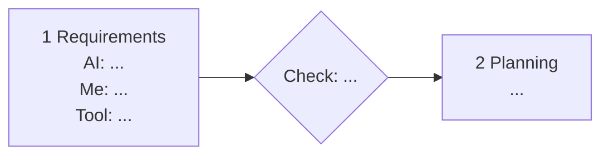

# 4. Your AI Pipeline

Your AI pipeline is the way you run AI across the lifecycle: where AI does the work, where you check it, which tool does what, and what the AI knows at each moment. You write it down in `docs/ai-pipeline.md` (headings already in place) and your repository proves it.

Draft it on Day 1, after guides 1 to 3. Update it as you go. Finish it on Day 5 so it describes what you **actually** did.

---

## What `docs/ai-pipeline.md` Must Contain

### Part 1: The pipeline diagram

One diagram with all seven stages. For each stage, show what the **AI** does, what **you** do, the **tool**, and the **checkpoint** where you review before moving on. Any tool is fine as long as it displays inline. A Mermaid starting point:

### Part 2: Tools

A small table: each tool, the stages you used it in, and why.

### Part 3: Context

How you control what the AI knows.

1. **`CLAUDE.md`:** what you put in it, and one lesson you added after the AI got something wrong.
2. **Fresh sessions:** when you start a new session, and why.
3. **Never in context:** secrets, real personal data, anything under NDA.

### Part 4: Token use

AI costs money and time, and a context stuffed with old chat gives worse answers. Show that you use it wisely.

1. **Usage log.** A row per stage with your rough usage. In Claude Code, `/cost` or `/usage` shows it; other tools have a usage page. Rough numbers are fine.
2. **Your habits.** The three or four habits you actually used to keep usage down. For example: a clear `CLAUDE.md`, a fresh session per task, plan before code, short instructions that name the files, the lighter model for simple work.
3. **One before and after.** One task where you first worked carelessly and then efficiently, with both numbers and what you changed. Keep it honest; a small difference is still a real result.

### Part 5: What changed

Two or three lines comparing your Day 1 draft with your final version.

---

## The Files That Prove It

| File | What the reviewer looks for |
|---|---|
| `CLAUDE.md` | Filled in on Day 1, and changed at least once more as you learned |
| `docs/0N-*.md` | The "AI did / I decided" section in each stage document |
| Your commit history | Small commits spread across the week |
